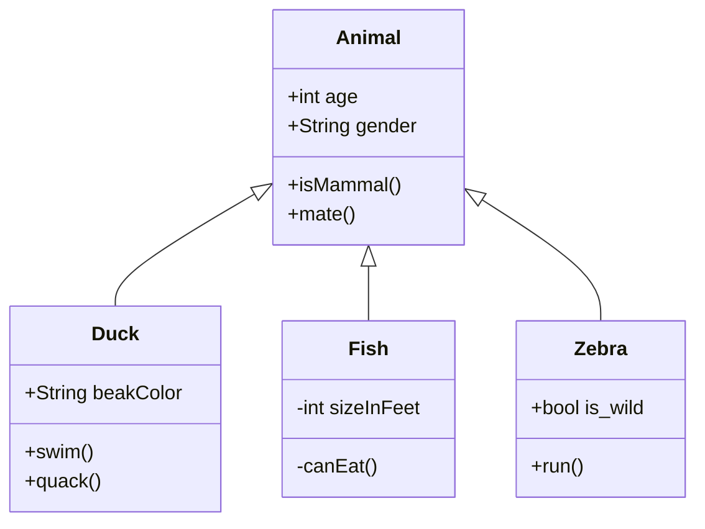

Syntax highlight is supported with the language specified after the first set of backticks. We use prismjs for syntax highlighting, a list of supported languages can be found [at their site](https://prismjs.com/#supported-languages)


```js
function fancyAlert(arg) {
  if(arg) {
    $.facebox({div:'#foo'})
  }
}
```
    
	
```md
    Text indented with a tab is formatted like this, and will also look like a code block in preview. 
```

    Text indented with a tab is formatted like this, and will also look like a code block in preview. 

```sql
select * from nagl n where n.id_nagl = :ID_NAGL
into :ABC
```

>[!info] MERMAID
>Jeżeli w kod bloku dam nagłówek **mermaid** to uzyskam diagram z mermaid.live

PRZYKŁAD:



<pre><code>```js
function fancyAlert(arg) {
  if(arg) {
    $.facebox({div:'#foo'})
  
}
```</code></pre>
